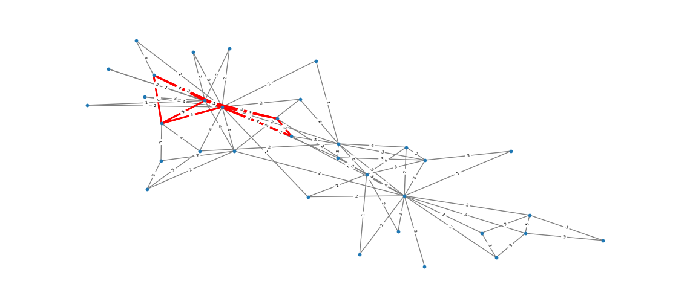
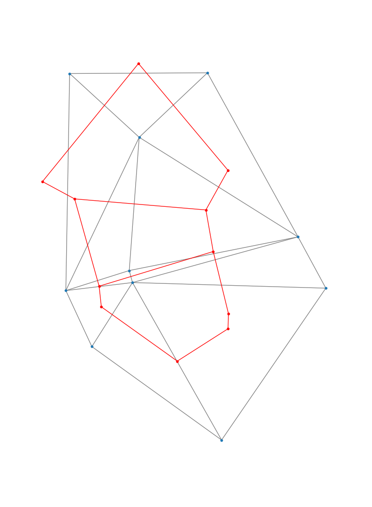

# Intro
This repository is a quick-proof of concept for using the python and the networkx library to import publicly available traffic data to find and report on the presence of cliques.

## Topological Data Analysis
Topological Data Analysis is, unsurprisingly, the analysis of datasets using topology.

The main result in this field is the [Structure Theorem](https://en.wikipedia.org/wiki/Topological_data_analysis#Structure_theorem).
Which lets us extract useful information from a sequence of nested complexes.

The suggested workflow is starting with a points cloud,
induce a topologies on the points in some manner that produces nested complexes,
then use the structure theorem to obtain useful persistent homology.
 
 ## Fluffy reading
 [This article](https://www.quantamagazine.org/geometry-reveals-how-the-world-is-assembled-from-cubes-20201119/) is a nice fluffy piece about the use of Voronoi Cell's in ["Multidimensional Persistence"](https://en.wikipedia.org/wiki/Topological_data_analysis#Multidimensional_persistence), which show the application of Topological Data Analysis as a burgeoning field of practical computation.
# Example 1
In this example I use networkx's inbuilt example weighted graph to find and highlight cliques of size 4.
The source code is located in the file "example1.py":

# Example 2
In this example I use SciPy's ability to calculate Voronoi Cell's to extract the [Alpha Complexe](https://courses.cs.duke.edu/fall06/cps296.1/Lectures/sec-III-4.pdf) (In the limit of ball sizes going to infinity).
For the bellow example the blue points are the original point cloud,
the grey lines is the induced topology,
and the red lines are the Voronoi cells.
Source code found in "example2.py":

Two notes about this result:
1. The idea with extracting the limit first is that we can create the required sequence of nested complexes by ordering the Voronoi ridges based on distance to the original points.
2. The lines may look a bit weird because they don't perpendicularly cross the Voronoi cells. This is because at this stage we are only thinking topologically, not geometrically and bending the lines to match the Voronoi Ridges wouldn't change the topology (Same nodes with the same edges, just more or less curved). Keep in mind that the geometric information isn't lost and is embedded in the nested complexes. I've included [an image of SciPy’s inbuild Voronoi graph](output2_1.png) which shows the relation between the point cloud and Voronoi Cells better, but doesn't include the nerve.
